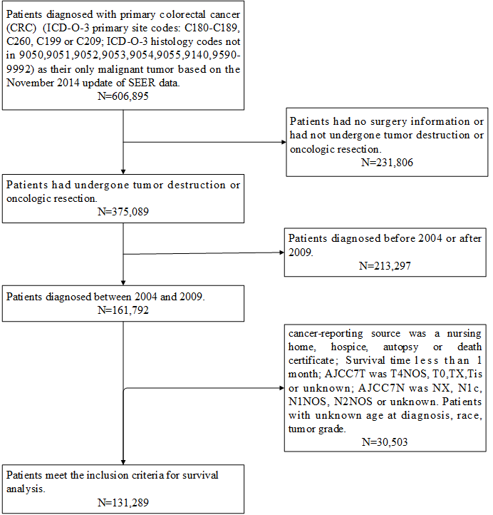
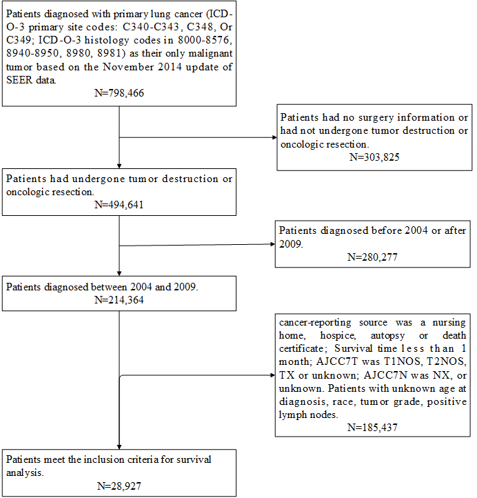
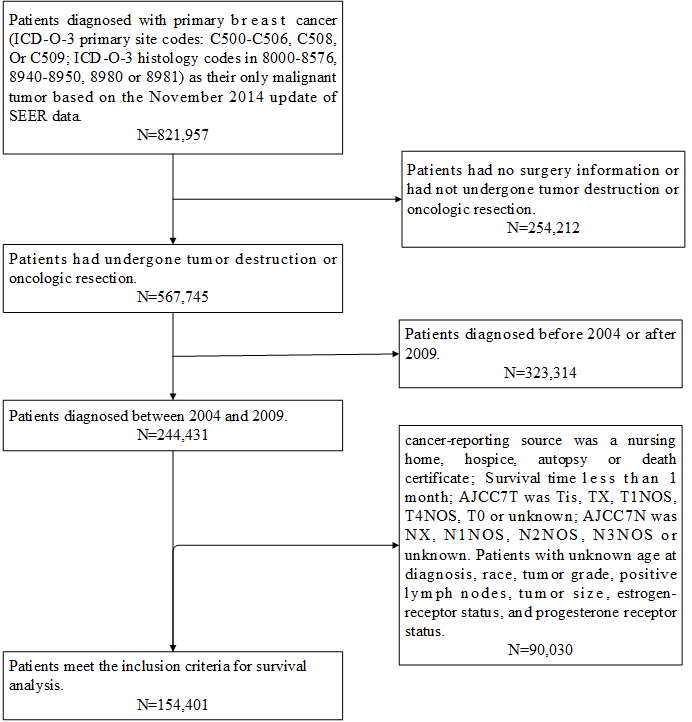
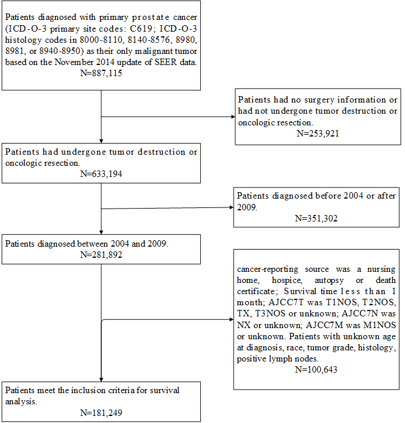

# SSMTL
SSMTL implements a deep learning-based semisupervised multitask learning model for survival analysis.


## Usage

### Clone the repository:<br />

```
git clone https://github.com/LeyiChi/SSMTL.git
```


### Download the November 2014 update of the National Cancer Institute Surveillance Epidemiology End Results registry (SEER) data:<br/>
1. visit official site [here](https://seer.cancer.gov/data/access.html), submit a request for access to the data, download and put it under ./data.

### Requirement
1. Keras 2.2.4
2. tensorflow-gpu 2.0.0
3. pycox 0.2.1
4. Some other libraries (find what you miss when running the code)

### Data Preparation
1. Extract data from the downloaded SEER data using sql. The data extraction processes were as follows:
- **CRC data** <br/>

- **Lung data** <br/>

- **Breast data** <br/>

- **Prostate data** <br/>


2. put the extracted data into ./data file directory with the file format .R for R and .csv for python.
3. run python 000-data_process.py to transform categorical variables to one-hot encoded variables.

### 5. training
1. coarse-scaled DenseASPP model training:
```
python train_pancreas_c2f200_coarse.py
```
2. fine-scaled DSD-ASPP-Net model training:
```
python train_pancreas_c2f200_saliency.py
```
### 6. testing
1. coarse-scaled model testing:
```
python test_organ_coarse_batch.py
```
2. fine-scaled model testing:
```
python test_organ_fine_batch.py
``` 
